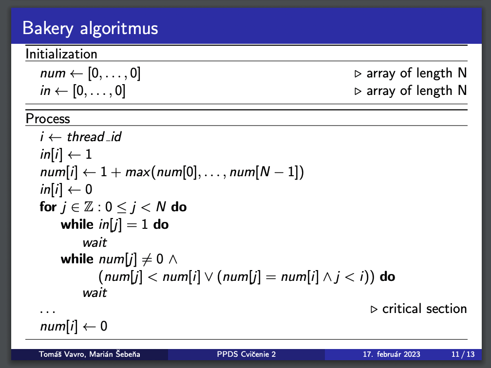

# Bemberakova_97392_feippds -01
[](https://www.python.org/downloads/release/python-3102/)
[](https://github.com/dominikabemberakova/Bemberakova_97392_feippds/blob/main/LICENSE)
[](https://conventionalcommits.org)

# About

This code implements the Bakery algorithm for mutual exclusion problem. The mutual exclusion problem occurs when multiple processes need to access a shared resource at the same time. The goal is to ensure that only one process can access the resource at any given time, to prevent conflicts and ensure the correctness of the system.

# Assignment
Your task for the first assignment is to implement the Bakery algorithm. Create a branch named "01" in your repository to work on this task. The source code must be compatible with Python 3.10 and use threads from the fei.ppds library.

The source code must:
1. include a module header with a description of the module, author name, and license
2. be well documented: each function (or class and its methods) must have a docstring in accordance with PEP 257
3. be commented to a reasonable extent. Comments should only be placed where necessary for understanding the context.
4. be in accordance with PEP 8

Documentation should be written in the README.md file in the 01 branch (not in the README.md file in the master/main branch). In the documentation, formulate the problem you are solving, how your code should be executed, etc. (i.e. all the information that a person who randomly discovers your source code on the Internet would need).

Furthermore, provide an explanation in the documentation of why the Bakery algorithm is a correct solution to the mutual exclusion problem (see the necessary conditions from the presentation from the exercise). You can choose either English or Slovak as the language of the documentation. Write the docstrings or module header in the chosen language as well.

# Problem solution:

The code implements the Bakery algorithm, which is a solution to the mutual exclusion problem. The algorithm ensures that only one process can access a shared resource at a time, preventing race conditions and other synchronization problems. The problem of mutual exclusion arises when multiple processes compete for access to a shared resource, and it is necessary to ensure that only one process at a time can execute a critical section of code that accesses this resource.

# Why the bakery algorithm is a correct solution to the mutual exclusion problem?

The bakery algorithm is a correct solution to the mutual exclusion problem because it satisfies the required conditions for a mutual exclusion algorithm. It ensures that only one thread can execute the critical section at a time, and that once a thread has requested access to the critical section, it will eventually gain access. Additionally, the algorithm does not allow for starvation of any thread, meaning that each thread will eventually enter the critical section.

The algorithm works by assigning a unique number to each thread that wants access to the critical section. Each thread then compares its number with the numbers of other threads that have requested access. The thread with the lowest number is granted access to the critical section, while the other threads must wait their turn. This ensures that threads enter the critical section in a predetermined order and that each thread will eventually gain access.

Overall, the bakery algorithm is a fair and efficient solution to the mutual exclusion problem, making it a popular choice for implementing critical sections in multi-threaded programs.

## Identical parts
I used the algorithm that was shown to us in the exercise and also in the lecture.


**Bakery algorithm:**
The code consists of a function bakery_algorithm(tid), which takes a thread ID (tid) as an input and executes the bakery algorithm to enter the critical section. The algorithm is based on a distributed system of processes (threads), where each process gets a unique number assigned to it based on its arrival time. The algorithm ensures that the process with the lowest number gets access to the critical section first.

```python
def bakery_algorithm(tid: int):
    global choose, number

    # assign order to process
    choose[tid] = True
    number[tid] = max(number) + 1
    choose[tid] = False

    # wait for other processes to release the critical section
    for j in range(NUM_THREADS):
        # skip current process
        if j == tid:
            continue
        # wait for processes currently deciding on entering the critical section
        while choose[j]:
            pass
        # wait until process with lower number has finished
        while (number[j] != 0) and ((number[j], j) < (number[tid], tid)):
            pass

```

The algorithm uses two shared data structures: choose and number. The choose list is used to indicate whether a process is interested in entering the critical section, and the number list is used to store the unique numbers assigned to each process. The algorithm works as follows:

1. A process announces its interest in entering the critical section by setting its choose value to True and assigns itself a unique number that is one more than the maximum value in the number array.

2. The process then waits for all other processes to release the critical section by going through a loop for each process.

3. For each process, the algorithm checks if it has a lower number and is not currently in the choose state. If the process is choose, the algorithm waits until it finishes. If the process has a lower number, the algorithm waits until it enters the critical section or exits it.

4. Once the process has confirmed that it can enter the critical section, it executes the critical section, which in this example is a sleep(1) command.

5. After completing the critical section, the process sets its number to zero, indicating that it has released the critical section.

The provided code includes a global variable NUM_THREADS, which sets the number of threads/processes to create and a DEFAULT_NUM_RUNS variable, which sets the number of times each thread should execute the algorithm. The main thread creates the required number of threads and starts them. The code ensures that all threads complete before terminating.


