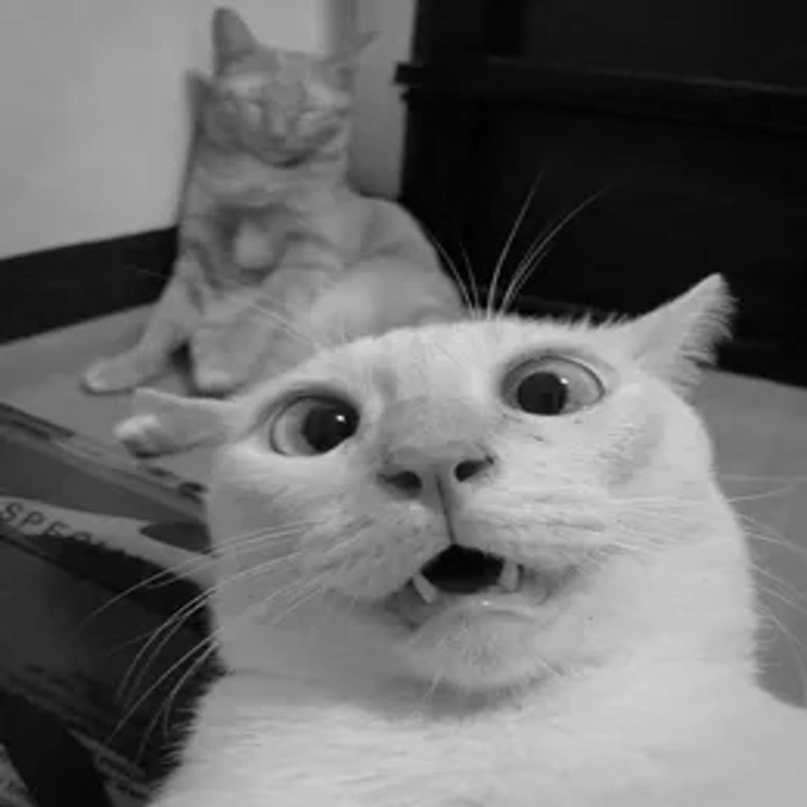

# Bemberakova_97392_feippds -05
[](https://www.python.org/downloads/release/python-3102/)
[](https://github.com/dominikabemberakova/Bemberakova_97392_feippds/blob/main/LICENSE)
[](https://conventionalcommits.org)

[OpenAI (2021) "ChatGPT (GPT-3.5)"](https://chat.openai.com/)

# Assignment
Submission deadline: May 12, 2023, 23:59:59
5 points
Instructions:
1. Load an image in jpg format, convert it to grayscale using GPU and save it to a new file.
2. Load an image in jpg format, convert it to grayscale using CPU and save it to a new file.
3. Convert a larger number of images using both methods. Record the average conversion times.
4. Include information about the task, instructions for running the code, and a comparison of CPU and GPU conversion in the documentation. Also, add some examples of converted images. Don't forget to mention the calculation used for conversion.
## Git Documentation for Grayscale Image Conversion Comparison (CPU vs. GPU)

This module implements a script that converts color images to grayscale using both CPU and GPU processing. The module includes two functions that perform grayscale conversion, one using CPU processing and the other using GPU processing. The code uses the Numba library to run the CUDA kernel for GPU processing and the Pillow library to manipulate the images.

## Requirements

- Numba 0.53.1 or higher
- Pillow 8.2.0 or higher
- CUDA capable GPU

## Functions

### `cuda_calculate`
```python
@cuda.jit
def cuda_calculate(image_in, image_out):
    x, y = cuda.grid(2)

    if x < image_in.shape[0] and y < image_in.shape[1]:
        r, g, b = image_in[x, y]
        gray_value = 0.2989 * r + 0.5870 * g + 0.1140 * b
        image_out[x, y] = gray_value
```

This function is a CUDA kernel that calculates the grayscale value for each pixel in the input image and stores it in the output image.

**Arguments:**

- `image_in`: A numpy array representing the input image.
- `image_out`: A numpy array representing the output image.

### `grayscale_on_cpu`
This function converts the input image to grayscale using CPU processing.
```python
def grayscale_on_cpu(image):
    image_in = np.array(image)
    image_out = np.empty((image_in.shape[0], image_in.shape[1]), dtype=np.uint8)

    for i in range(image_in.shape[0]):
        for j in range(image_in.shape[1]):
            r, g, b = image_in[i, j]
            gray_value = 0.2989 * r + 0.5870 * g + 0.1140 * b
            image_out[i, j] = gray_value

    return image_out
```

### `grayscale_on_gpu`

This function converts the input image to grayscale using GPU processing.
```python
def grayscale_on_gpu(image):
    image_in = cuda.to_device(np.array(image))
    image_out = cuda.device_array((new_height, new_width), dtype=np.uint8)

    threadsperblock = (32, 32)
    blockspergrid_x = (image_in.shape[0] + threadsperblock[0] - 1) // threadsperblock[0]
    blockspergrid_y = (image_in.shape[1] + threadsperblock[1] - 1) // threadsperblock[1]
    blockspergrid = (blockspergrid_x, blockspergrid_y)

    cuda_calculate[blockspergrid, threadsperblock](image_in, image_out)
    
    return image_out.copy_to_host()
```
**Input image 1**: 


**Output image 1**: 

The output will be displayed on screen but we have provided a peview.

<table>
  <tr>
    <td>output1_cpu</td>
     <td>output1_gpu</td>
  </tr>
  <tr>
    <td></td>
    <td></td>
  </tr>
 </table>

**Printouts:**
```
Grayscale image1 saved successfully! GPU Time elapsed: 6.4200 seconds
Grayscale image1 saved successfully! CPU Time elapsed: 0.1953 seconds
```
**Input image 2**: 


**Output image 2**: 

The output will be displayed on screen but we have provided a peview.

<table>
  <tr>
    <td>output2_cpu</td>
     <td>output2_gpu</td>
  </tr>
  <tr>
    <td></td>
    <td></td>
  </tr>
 </table>

**Printouts:**
```
Grayscale image2 saved successfully! GPU Time elapsed: 8.1257 seconds
Grayscale image2 saved successfully! CPU Time elapsed: 0.2391 seconds
```

**Input image 3**: 


**Output image 3**: 

The output will be displayed on screen but we have provided a peview.

<table>
  <tr>
    <td>output3_cpu</td>
     <td>output3_gpu</td>
  </tr>
  <tr>
    <td></td>
    <td></td>
  </tr>
 </table>

**Printouts:**
```
Grayscale image3 saved successfully! GPU Time elapsed: 8.4400 seconds
Grayscale image3 saved successfully! CPU Time elapsed: 0.2568 seconds
```


